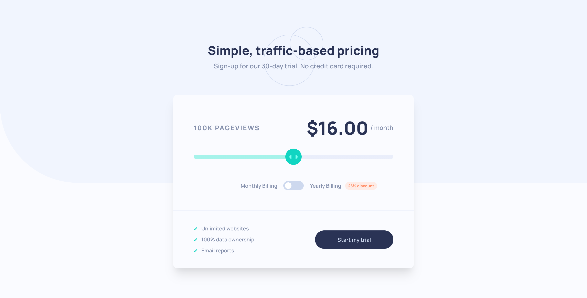

# Interactive pricing component using VueJS!

### The challenge

Users should be able to:

-   View the optimal layout for the app depending on their device's screen size
-   See hover states for all interactive elements on the page
-   Use the slider and toggle to see prices for different page view numbers

## My tools:

-   [x] VueJS;
-   [x] VueX;
-   [x] SCSS;
-   [x] BEM CSS;
-   [x] Atomic Design principles;

**You can see the live demo and give feedbacks on the [FrontendMentor's page](https://www.frontendmentor.io/solutions/interactive-pricing-component-using-vuejs--4V8eQnpE).**
